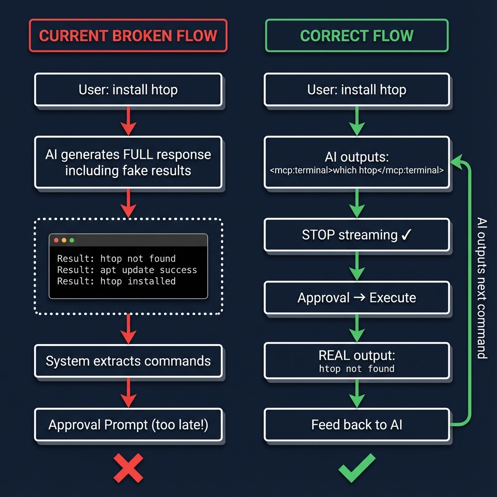
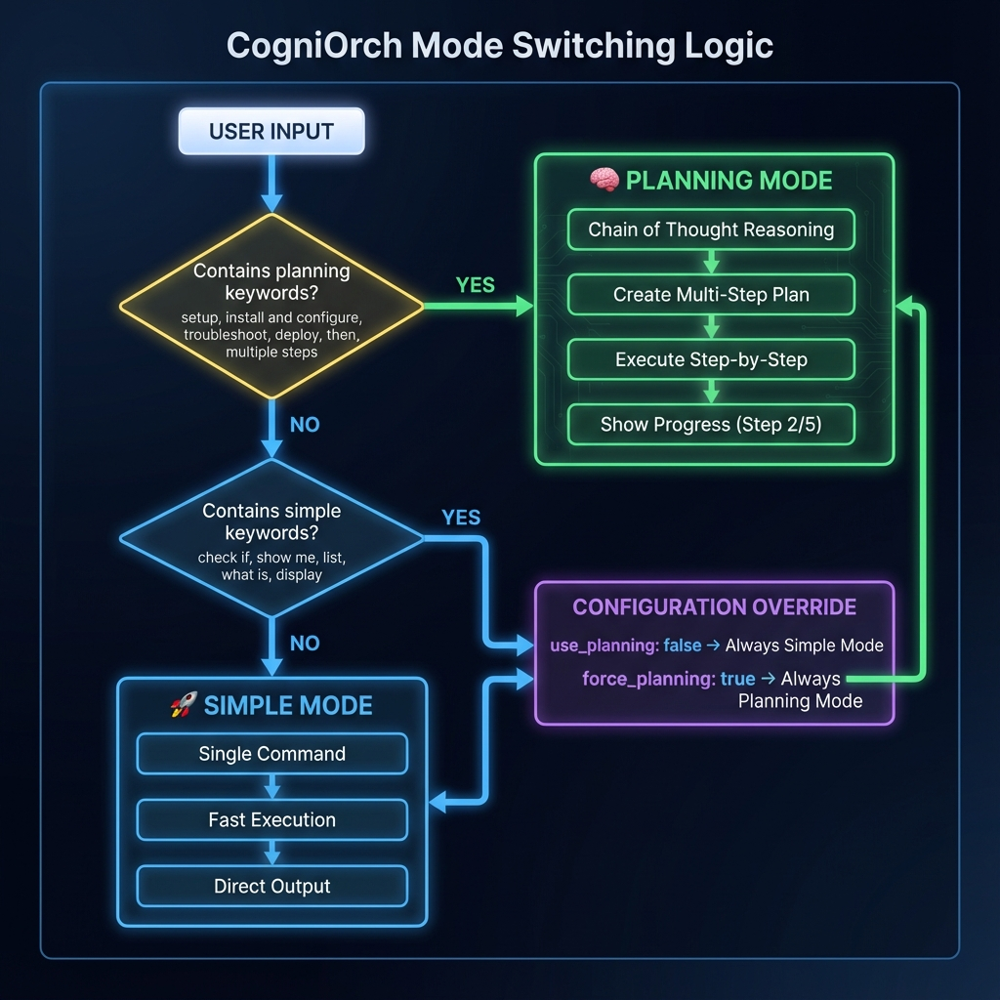

# CogniOrch - Your Intelligent Linux Terminal Assistant

CogniOrch is an advanced AI assistant designed to enhance your Linux terminal experience. It executes commands with explicit approval, analyzes outputs, and plans multi‑step actions using an intelligent agentic workflow. Now with **Chain of Thought reasoning** and **automatic complexity detection**!

## ✨ What's New in v2.0

### 🧠 Dual-Mode Intelligence

- **Simple Mode**: Lightning-fast execution for straightforward commands
- **Planning Mode**: Full Chain of Thought reasoning + multi-step planning for complex tasks
- **Auto-Detection**: Intelligently switches between modes based on task complexity

### � Key Features

- **Zero Hallucination**: AI never generates fake command results - all output is real
- **Visible Reasoning**: See the AI's thought process for complex tasks
- **Multi-Step Planning**: Automatic plan creation and execution with progress tracking
- **True Feedback Loop**: Commands execute → Real output → AI analyzes → Next step
- **MCP Protocols**: `terminal`, `files`, `analyze`, `network`, `security`
- **Approval Gating**: Every command requires your approval (configurable)
- **Persistent Terminal**: Reuses a dedicated terminal window for all commands
- **RAG Knowledge Base**: Learns from successful executions

## 📊 How It Works

### The Hallucination Fix

**Before v2.0** (Broken):

```
User: "install htop"
AI generates: 
  Result: htop not found (FAKE!)
  Result: apt update success (FAKE!)
  Result: htop installed (FAKE!)
Then asks for approval (too late!)
```

**After v2.0** (Fixed):

```
User: "install htop"
AI: <mcp:terminal>which htop</mcp:terminal>
[Approval] → [Real execution]
AI receives actual output → Analyzes → Next step
```



### Mode Switching

The system automatically chooses the best execution mode:



**Planning Mode Triggers:**

- Keywords: `setup`, `install and configure`, `deploy`, `troubleshoot`, `build and test`
- Shows Chain of Thought reasoning
- Creates multi-step execution plans
- Tracks progress (Step 2/5)

**Simple Mode Triggers:**

- Keywords: `check if`, `show me`, `list`, `what is`, `display`
- Fast single-command execution
- No planning overhead

## 📦 Prerequisites

- Linux
- Python 3.8+
- Terminal emulator (gnome-terminal, konsole, xfce4-terminal, mate-terminal, terminator, tilix, kitty, alacritty)
- Optional backends:
  - **LM Studio / Ollama** (local) or
  - **DigitalOcean Agents** (cloud via OpenAI/Claude)

## 🚀 Installation

1. Clone the repository

```bash
git clone git@github.com:Rehan018/CogniOrch.git
cd CogniOrch
```

2. Run the installer (creates venv, installs deps, sets alias)

```bash
./install.sh
```

3. Add an alias manually (if needed)

```bash
echo "alias cogniorch='source $(pwd)/venv/bin/activate && python3 $(pwd)/main.py'" >> ~/.bashrc
source ~/.bashrc
```

## ⚙️ Configuration

Create your config file:

```bash
cp config/config.yaml.example config/config.yaml
```

Edit `config/config.yaml` with one of these modes:

**Local (LM Studio/Ollama)**

```yaml
mode: "lm_studio"
api_url: "http://localhost:11434/v1"   # Ollama API or LM Studio API
api_key: "ollama"                       # LM Studio: "lm-studio"
model: "llama3.1:latest"               # Adjust per your local model
stream: true
command_approval:
  require_approval: true
  auto_approve_all: false
use_agentic_mode: true
```

**Cloud (DigitalOcean/OpenAI/Claude)**

```yaml
mode: "digital_ocean"
digital_ocean_config:
  agent_id: "your-agent-id"
  agent_key: "your-agent-key"
  agent_endpoint: "https://your-endpoint.app/api/v1"
  model: "gpt-4o-mini"  # example
stream: true
command_approval:
  require_approval: true
  auto_approve_all: false
use_agentic_mode: true
```

**Advanced Settings** in `config/agent_config.yaml`:

```yaml
use_cot: true              # Chain of Thought reasoning
use_planning: true         # Multi-step planning
use_rag: true              # RAG knowledge base
```

## 🖥️ Usage

**Classic interface:**

```bash
cogniorch --classic
```

**Improved UI** (requires prompt_toolkit/pygments):

```bash
cogniorch
```

### Example: Simple Command

```
You: check if docker is installed
CogniOrch: <mcp:terminal>which docker</mcp:terminal>

╭──────────────────────────────────────────────────────────────────╮
│ COMMAND APPROVAL REQUIRED                                        │
│ which docker                                                     │
╰──────────────────────────────────────────────────────────────────╯
  ↳ Execute this command? (Allow/Reject) [Y/n]: y
  ✓

CogniOrch: Docker is installed at /usr/bin/docker
```

### Example: Complex Task (Planning Mode)

```
You: setup a python web server and test it

============================================================
🧠 AGENTIC PLANNING MODE ACTIVATED
============================================================

💭 Chain of Thought Reasoning:
1. Understand: User wants Python HTTP server running and tested
2. Requirements: Python (already present), test file, curl
3. Approach: Create test file → Start server → Test with curl
4. Steps: 3 main steps
5. Considerations: Use built-in http.server module

📋 Creating Execution Plan:
✓ Plan created with 3 steps

⚡ Executing Plan:

Step 1/3: echo "<h1>Test</h1>" > index.html
[Approval] → [Execute] → ✓ Success

Step 2/3: python3 -m http.server 8000 &
[Approval] → [Execute] → ✓ Success

Step 3/3: curl http://localhost:8000
[Approval] → [Execute] → ✓ Success

============================================================
📊 Plan Execution Complete: 3/3 steps successful
============================================================
```

## 🧩 MCP Protocols

- `terminal`: Execute shell commands
- `files`: Read/write/append/list files and directories
- `analyze`: System overview (CPU/memory/disk/network/services)
- `network`: Network operations (ping/trace/scan/lookup/whois)
- `security`: Security checks (users/groups/ports/SUID/cron/failed-logins)

**Examples:**

```text
<mcp:terminal>ps aux | head</mcp:terminal>
<mcp:files>read:/etc/hosts</mcp:files>
<mcp:network>scan:192.168.1.0/24</mcp:network>
<mcp:security>ports</mcp:security>
```

## 🔐 Security Model

- ✅ All commands require explicit approval (unless `auto_approve_all: true`)
- ✅ Safety verification detects dangerous patterns (`rm -rf /`, fork bombs, etc.)
- ✅ Operates with your user privileges; denial stops execution
- ✅ No privilege escalation attempts after denial
- ✅ Persistent terminal artifacts stored in temp (gitignored)

## 🧠 Intelligence Features

### Chain of Thought (CoT)

When enabled, the AI shows its reasoning process:

```
1. Understand: What is being asked?
2. Requirements: What do we need?
3. Approach: How should we do it?
4. Steps: Execution sequence
5. Considerations: Safety and risks
```

### Automatic Complexity Detection

The system analyzes your request and automatically chooses:

- **High Complexity** → Planning Mode (setup, deploy, troubleshoot)
- **Low Complexity** → Simple Mode (check, show, list)
- **Medium Complexity** → Simple Mode (default to fast)

### Feedback Loop

```
Command → Real Execution → Actual Output → 
AI Analysis → Next Decision → Repeat
```

## 🗂️ Project Structure

```
CogniOrch/
├── main.py                      # Entry point
├── config/
│   ├── config.yaml             # Main configuration
│   ├── agent_config.yaml       # Agent settings
│   └── PrePromt.md             # System instructions
├── src/
│   ├── ai_core.py              # Core AI with dual-mode routing
│   ├── terminal_ui.py          # Improved UI
│   ├── terminal_interface.py   # Classic interface
│   ├── command_executor.py     # Persistent terminal
│   ├── approval_handler.py     # Approval prompts
│   ├── verification.py         # Safety checks
│   ├── context_manager.py      # Context management
│   ├── agents/                 # Agent system
│   │   ├── executor_agent.py   # Command executor
│   │   ├── planner_agent.py    # Task planner
│   │   └── base_agent.py       # Agent base class
│   ├── reasoning/              # Reasoning engines
│   │   ├── cot_engine.py       # Chain of Thought
│   │   └── react_engine.py     # ReAct pattern
│   ├── orchestration/          # Orchestration
│   │   ├── orchestrator.py     # Main orchestrator
│   │   └── state_manager.py    # State management
│   ├── mcp_protocol/           # MCP handlers
│   │   ├── core.py             # Protocol parser
│   │   ├── registry.py         # Handler registry
│   │   └── handlers/           # Protocol implementations
│   └── rag/                    # RAG system
│       └── knowledge_base.py   # Knowledge storage
└── assets/
    └── docs/                   # Documentation images
```

## 📚 Documentation

- **[Mode Switching Guide](.agent/MODE_SWITCHING_GUIDE.md)** - How to control execution modes
- **[Agentic System Integration](.agent/AGENTIC_SYSTEM_INTEGRATION.md)** - Full feature documentation
- **[Hallucination Fix Plan](.agent/workflows/fix-hallucination-issue.md)** - Implementation details

## 🛠️ Development

```bash
# Create venv and install dependencies
python3 -m venv venv
source venv/bin/activate
pip install -r requirements.txt

# Run in classic mode
venv/bin/python main.py --classic

# Check logs
tail -f ~/.cogniorch/cogniorch.log
```

## 🎯 Use Cases

### System Administration

```
"troubleshoot why nginx won't start"
→ Planning Mode: Check status → Check config → Check logs → Diagnose issue
```

### Development Setup

```
"setup a python project with virtual environment and install requests"
→ Planning Mode: Create dir → Setup venv → Activate → Install packages
```

### Quick Queries

```
"show me running docker containers"
→ Simple Mode: docker ps → Done
```

### Security Auditing

```
"analyze system security and check for vulnerabilities"
→ Planning Mode: Check users → Check ports → Check permissions → Report
```

## 🔄 Workflow Examples

**Multi-Step Task:**

```
User: "create a backup of /etc and compress it"

Planning Mode activates:
1. Check /etc exists
2. Create backup directory
3. Copy /etc to backup
4. Compress with tar
5. Verify backup integrity
```

**Adaptive Execution:**

```
User: "install nginx"

Step 1: Check if already installed
  → Not found
Step 2: Try apt install
  → Package not found
Step 3: Update package list
  → Success
Step 4: Retry install
  → Success
```

## 🤝 Contributing

Contributions are welcome! Please:

1. Fork the repository
2. Create a feature branch
3. Make your changes
4. Add tests if applicable
5. Submit a pull request

## 📜 License

BSD 3‑Clause License. See [LICENSE](LICENSE).

## 🙏 Acknowledgments

- Built with Claude 3.5 Sonnet via Gemini Code Assist
- Uses OpenAI-compatible APIs (LM Studio, Ollama, DigitalOcean)
- Inspired by ReAct and Chain of Thought research

---

**Version**: 2.0 - Full Agentic System  
**Last Updated**: November 2025  
**Status**: 🟢 Production Ready
