# CogniOrch - Advanced AI Terminal Assistant

<div align="center">


**An intelligent, agentic terminal assistant powered by advanced AI reasoning**

[Features](#-features) • [Quick Start](#-quick-start) • [Architecture](#-architecture) • [Configuration](#-configuration) • [Usage](#-usage) • [Troubleshooting](#-troubleshooting)

</div>

---

## 🌟 Features

- **🤖 Multi-Agent Architecture** - Planner, Executor, and Verifier agents working in harmony
- **💭 Advanced Reasoning** - Chain of Thought (CoT) and ReAct patterns for intelligent problem-solving
- **📋 Hierarchical Planning** - Automatic task decomposition and multi-step execution
- **🔐 Safety First** - Dangerous command detection and user approval workflows
- **🌐 Multi-Backend Support** - OpenAI API, Ollama, or DigitalOcean AI
- **💾 Knowledge Management** - RAG system for context-aware responses
- **⚡ Smart Command Execution** - Persistent terminal sessions with auto-retry
- **📚 Conversation History** - Full chat history tracking and retrieval
- **🛠️ Tool Registry** - Extensible tool system for custom operations

---

## 📋 Table of Contents

1. [Prerequisites](#prerequisites)
2. [Quick Start](#-quick-start)
3. [Installation](#-installation)
4. [Configuration](#-configuration)
5. [Architecture](#-architecture)
6. [Usage Guide](#-usage-guide)
7. [API Documentation](#-api-documentation)
8. [Troubleshooting](#-troubleshooting)
9. [Contributing](#-contributing)
10. [License](#license)

---

## Prerequisites

### System Requirements

- **Operating System**: Linux, macOS, or Windows (with WSL2)
- **Python**: 3.6 or higher
- **Terminal**: Any modern terminal emulator (gnome-terminal, konsole, xterm, etc.)
- **Disk Space**: ~500MB for dependencies
- **RAM**: Minimum 2GB (4GB recommended)

### Required Tools

```bash
# Linux
sudo apt-get update
sudo apt-get install python3 python3-pip python3-venv portaudio19-dev

# macOS
brew install python3 portaudio

# Windows (WSL2)
apt-get update
apt-get install python3 python3-pip python3-venv portaudio19-dev
```

### API Requirements

Choose one of the following:

**Option 1: OpenAI API**
- Create account at https://openai.com
- Generate API key from https://platform.openai.com/api-keys
- Minimum: $5 monthly credit

**Option 2: Ollama (Local)**
- Download from https://ollama.com
- Install for Windows: `ollama-windows-amd64.exe`
- Runs locally on your machine
- Free

**Option 3: DigitalOcean AI**
- Create account at https://www.digitalocean.com
- Get API credentials
- Pay-per-use pricing

---

## 🚀 Quick Start

### 1. Clone Repository

```bash
git clone https://github.com/Rehan018/CogniOrch.git
cd CogniOrch
```

### 2. Install Using Script (Linux/macOS)

```bash
chmod +x install.sh
./install.sh
```

### 3. Manual Installation

```bash
# Create virtual environment
python3 -m venv venv

# Activate virtual environment
# Linux/macOS:
source venv/bin/activate
# Windows:
# venv\Scripts\activate

# Install dependencies
pip install -r requirements.txt
```

### 4. Configure

```bash
# Copy example config
cp config/config.yaml.example config/config.yaml

# Edit configuration (see Configuration section below)
nano config/config.yaml
```

### 5. Run

```bash
# Run with improved UI (recommended)
python3 main.py

# Or use classic interface
python3 main.py --classic

# Debug mode
python3 main.py --debug

# Show version
python3 main.py --version
```

---

## 📦 Installation

### Full Installation Guide

#### Step 1: Clone the Repository

```bash
git clone https://github.com/Rehan018/CogniOrch.git
cd CogniOrch
```

#### Step 2: Create Virtual Environment

```bash
# Create venv
python3 -m venv venv

# Activate (Linux/macOS)
source venv/bin/activate

# Activate (Windows)
venv\Scripts\activate

# Verify activation (should show (venv) prefix)
which python
```

#### Step 3: Install Dependencies

```bash
# Upgrade pip
pip install --upgrade pip

# Install from requirements.txt
pip install -r requirements.txt
```

**Dependencies installed:**
```
setuptools==74.1.2      # Package building
requests==2.31.0        # HTTP requests for Ollama
pyyaml==6.0.1           # YAML parsing
pynput==1.7.7           # Input handling
httpx==0.28.1           # HTTP requests
PyJWT==2.10.1           # JWT tokens
prompt_toolkit==3.0.43  # CLI interface
pygments==2.17.2        # Syntax highlighting
psutil==6.1.1           # System utilities
```

#### Step 4: Setup Configuration

```bash
# Copy example config
cp config/config.yaml.example config/config.yaml

# Create config directory if missing
mkdir -p config

# Edit configuration
nano config/config.yaml
```

#### Step 5: Verify Installation

```bash
# Test imports
python3 -c "import requests; import yaml; print('✓ Dependencies installed')"

# Test basic functionality
python3 main.py --version
```

---

## ⚙️ Configuration

### Configuration File Structure

**Location:** `config/config.yaml`

```yaml
# ===== API CONFIGURATION =====

# Mode: 'ollama', 'openai', or 'digital_ocean'
mode: ollama

# Ollama Configuration (local LLM)
ollama_config:
  api_url: "http://localhost:11434"
model: "mistral"  # Ollama model name

# OpenAI Configuration
api_url: "https://api.openai.com/v1"
api_key: "sk-..."  # Your OpenAI API key
model: "gpt-4"

# DigitalOcean Configuration
digital_ocean_config:
  agent_id: "your_agent_id"
  agent_key: "your_agent_key"
  agent_endpoint: "https://api.do-ai.run/v1/agents/..."
  model: "claude-3-opus"

# ===== AGENTIC SYSTEM =====

# Enable agentic mode (recommended)
use_agentic_mode: true

# Command approval settings
command_approval:
  require_approval: true      # User must approve each command
  auto_approve_all: false     # Don't skip approval prompts

# Streaming responses
stream: true

# ===== AGENT CONFIGURATION =====

# Chain of Thought
cot:
  verbose: true
  max_steps: 10
  show_reasoning: true

# ReAct Pattern
react:
  verbose: true
  max_iterations: 10
  enable_tool_calling: true

# Planning Agent
planner:
  max_plan_steps: 15
  enable_refinement: true
  complexity_threshold: "medium"

# State Management
state:
  max_history_entries: 100
  auto_save: true
  save_interval: 60

# RAG System
rag:
  enabled: true
  max_context_entries: 5
  similarity_threshold: 0.7

# ===== SAFETY CONFIGURATION =====

safety:
  enable_verification: true
  require_approval: true
  dangerous_command_patterns:
    - "rm -rf /"
    - "mkfs"
    - "dd if="
  
# ===== LOGGING =====

logging:
  level: "INFO"  # DEBUG, INFO, WARNING, ERROR
  log_to_file: true
  log_file: "~/.cogniorch/cogniorch.log"
```

### Configuration Profiles

#### Profile 1: Local Development (Ollama)

```yaml
mode: ollama
ollama_config:
  api_url: "http://localhost:11434"
model: "mistral"
command_approval:
  require_approval: true
  auto_approve_all: false
stream: true
```

#### Profile 2: OpenAI Production

```yaml
mode: openai
api_url: "https://api.openai.com/v1"
api_key: "sk-your-key-here"
model: "gpt-4"
command_approval:
  require_approval: true
use_agentic_mode: true
stream: true
```

#### Profile 3: DigitalOcean

```yaml
mode: digital_ocean
digital_ocean_config:
  agent_id: "your_id"
  agent_key: "your_key"
  agent_endpoint: "https://api.do-ai.run/v1/..."
  model: "claude-3-opus"
command_approval:
  require_approval: true
```

---

## 🏗️ Architecture

### System Architecture Diagram

```mermaid
graph TB
    User["👤 User Input"]
    
    User -->|Query| TUI["🖥️ Terminal Interface<br/>TerminalInterface"]
    
    TUI -->|Process| Core["🧠 CogniOrchAI<br/>Core Engine"]
    
    Core -->|Route| Orch["🎯 Orchestrator<br/>Query Coordinator"]
    
    Orch -->|Assess| Comp{Complexity<br/>Assessment}
    
    Comp -->|High| Plan["📋 Planner Agent<br/>Task Decomposition"]
    Comp -->|Medium| React["⚡ ReAct Engine<br/>Reasoning + Acting"]
    Comp -->|Low| CoT["💭 CoT Engine<br/>Chain of Thought"]
    
    Plan -->|Execute| Exec["⚙️ Executor Agent<br/>Command Execution"]
    React -->|Execute| Exec
    CoT -->|Execute| Exec
    
    Exec -->|Parse| MCP["🔌 MCP Protocol<br/>Command Parser"]
    
    MCP -->|Handle| Term["📡 Terminal Handler<br/>Command Execution"]
    
    Term -->|Verify| Verify["🔐 Verification<br/>Safety Check"]
    
    Verify -->|Approve| Approval["✅ Approval Handler<br/>User Consent"]
    
    Approval -->|Execute| PTE["🖲️ Persistent Terminal<br/>Executor"]
    
    PTE -->|Output| Feedback["📊 Feedback Loop<br/>Result Analysis"]
    
    Feedback -->|Display| TUI
    
    Core -.->|Knowledge| RAG["📚 RAG System<br/>Knowledge Base"]
    Core -.->|State| State["💾 State Manager<br/>Context Tracking"]
    
    style User fill:#4a90e2,color:#fff
    style TUI fill:#7ed321,color:#fff
    style Core fill:#f5a623,color:#fff
    style Orch fill:#bd10e0,color:#fff
    style Exec fill:#50e3c2,color:#fff
    style Term fill:#b8e986,color:#000
    style PTE fill:#417505,color:#fff
    style Feedback fill:#ff6b6b,color:#fff
```



### Agent Workflow Diagram

```mermaid
graph LR
    A["🤖 Planner Agent<br/>Decompose Task"] -->|Plan| B["⚙️ Executor Agent<br/>Execute Step"]
    B -->|Monitor| C{Success?}
    C -->|Yes| D["✅ Mark Complete<br/>Move to Next"]
    C -->|No| E["🔄 Retry<br/>Up to 3 times"]
    E -->|Still Fail| F["❌ Error Handler<br/>Log & Report"]
    D -->|More Steps?| B
    F -->|Report| G["📋 Summary<br/>Return to User"]
    D -->|All Done| G
    
    style A fill:#e1bee7,color:#000
    style B fill:#bbdefb,color:#000
    style C fill:#fff9c4,color:#000
    style D fill:#c8e6c9,color:#000
    style E fill:#ffccbc,color:#000
    style F fill:#ffcdd2,color:#000
    style G fill:#b2dfdb,color:#000
```



### MCP Protocol Flow Diagram

```mermaid
graph TD
    A["🧠 LLM Response<br/>with MCP Tags"] -->|Parse| B["🔌 MCP Protocol<br/>parse_mcp_tags"]
    B -->|Extract| C["<mcp:protocol><br/>content</mcp:protocol>"]
    C -->|Route| D{"Protocol<br/>Type?"}
    D -->|terminal| E["📡 Terminal Handler"]
    D -->|files| F["📁 Files Handler"]
    D -->|network| G["🌐 Network Handler"]
    D -->|security| H["🔒 Security Handler"]
    E -->|Verify| I["🔐 CommandVerifier<br/>Check Safety"]
    I -->|Ask| J["✅ Approval Handler<br/>User Approval"]
    J -->|Approved| K["🖲️ Execute<br/>in Terminal"]
    J -->|Denied| L["❌ Reject<br/>Return Error"]
    K -->|Capture| M["📊 Output"]
    M -->|Feedback| N["🧠 LLM<br/>Analysis"]
    L -->|Feedback| N
    
    style A fill:#fff3e0,color:#000
    style B fill:#f3e5f5,color:#000
    style E fill:#e1f5fe,color:#000
    style J fill:#fce4ec,color:#000
    style K fill:#c8e6c9,color:#000
    style N fill:#fff9c4,color:#000
```



### State Machine Diagram


### Data Flow Diagram

```mermaid
graph TB
    Input["📥 User Input"]
    
    Input -->|1. Parse| Parser["🔍 Input Parser"]
    Parser -->|2. Extract Context| Ctx["📦 Context Manager"]
    Ctx -->|3. Retrieve Knowledge| KB["📚 Knowledge Base"]
    
    KB -->|4. Prepare Prompt| LLM["🧠 LLM Model"]
    
    LLM -->|5. Generate Response| Resp["📄 LLM Response"]
    Resp -->|6. Parse MCP Tags| MCP["🔌 MCP Protocol"]
    
    MCP -->|7a. Command Tags| Term["📡 Terminal Handler"]
    MCP -->|7b. File Tags| Files["📁 File Handler"]
    MCP -->|7c. Context Tags| CtxTag["📝 Context Extractor"]
    
    Term -->|8. Execute| Exec["⚙️ Command Executor"]
    Files -->|8. Operate| Exec
    CtxTag -->|8. Extract| Exec
    
    Exec -->|9. Capture Output| Output["📊 Output Capture"]
    Output -->|10. Store| History["💾 History Database"]
    History -->|11. Display| UI["🖥️ Terminal UI"]
    
    Output -->|12. Feedback| LLM
    
    UI -->|New Input| Input
    
    style Input fill:#e3f2fd,color:#000
    style Parser fill:#f3e5f5,color:#000
    style LLM fill:#fff3e0,color:#000
    style Term fill:#e0f2f1,color:#000
    style UI fill:#f1f8e9,color:#000
```



### Component Interaction Diagram


---

## 💻 Usage Guide

### Basic Usage

#### 1. Simple Query

```bash
$ python3 main.py

Welcome to CogniOrch Terminal.
You: What is the capital of France?

CogniOrch: The capital of France is Paris. It's located in the north-central part 
of the country and is known for its iconic landmarks like the Eiffel Tower, 
Notre-Dame Cathedral, and the Louvre Museum.
```

#### 2. Command Execution

```bash
You: Install htop

CogniOrch: I'll install htop for you.
<mcp:terminal>sudo apt install htop -y</mcp:terminal>

╭──────────────────────────────────────────────────────────────────╮
│ COMMAND APPROVAL REQUIRED                                        │
│                                                                  │
│ sudo apt install htop -y                                         │
│                                                                  │
╰──────────────────────────────────────────────────────────────────╯
  ↳ Execute this command? (Allow/Reject) [Y/n]: y
  
✓

[System] Executing command...
Reading package lists... Done
Setting up htop (3.2.1-1) ...
Processing triggers for man-db (2.9.4-2) ...

CogniOrch: Installation complete! htop has been successfully installed on your system.
```

#### 3. Complex Task

```bash
You: Setup a Python web server on port 8000

CogniOrch: I'll help you set up a Python web server. Let me create a plan:

Plan:
  Step 1: Create a directory for the project
  Step 2: Create a simple HTTP server script
  Step 3: Start the server
  Step 4: Verify it's running

Executing plan...

[Step 1] Creating directory...
✓ Project directory created

[Step 2] Creating server script...
✓ Server script created

[Step 3] Starting server...
✓ Server started on port 8000

[Step 4] Verifying...
✓ Server is accessible at http://localhost:8000

Your Python web server is now running!
```

### Command Line Options

```bash
# Default: Use improved UI
python3 main.py

# Use classic terminal interface
python3 main.py --classic

# Enable debug mode
python3 main.py --debug

# Show version
python3 main.py --version

# Show help
python3 main.py --help
```

### Interactive Commands

Within CogniOrch terminal:

```bash
# Show conversation history
You: history

# View previous interactions
[displays all previous conversations]

# Exit the application
You: exit

# Help command
You: help
```

### Advanced Usage

#### Enable Debug Mode

```bash
python3 main.py --debug

# Logs detailed information to console and file
# Location: ~/.cogniorch/cogniorch.log
```

#### Auto-Approve Commands (Use with Caution)

Edit `config/config.yaml`:

```yaml
command_approval:
  require_approval: true
  auto_approve_all: true  # Set to true
```

⚠️ **Warning**: Only use in trusted environments!

#### Custom Tool Configuration

Add to `config/agent_config.yaml`:

```yaml
tools:
  file_operations: true
  system_info: true
  process_management: true
  network: true
  package_management: true
  development: true
```

---

## 📚 API Documentation

### Main Classes

#### CogniOrchAI

```python
from src.ai_core import CogniOrchAI

# Initialize
config = {
    'api_url': 'http://localhost:1234/v1',
    'api_key': 'your-key',
    'model': 'gpt-3.5-turbo',
    'mode': 'lm_studio'
}

ai = CogniOrchAI(config)

# Query
result = ai.query("What's the weather?")

# Get history
history = ai.get_conversation_history()
```

#### Orchestrator

```python
from src.orchestration.orchestrator import Orchestrator

orchestrator = Orchestrator({
    'use_cot': True,
    'use_react': True,
    'use_planning': True
})

result = orchestrator.process_query("Your query here")
```

#### ExecutorAgent

```python
from src.agents.executor_agent import ExecutorAgent

executor = ExecutorAgent({
    'require_approval': True,
    'max_retries': 3
})

result = executor.process({
    'command': 'ls -la',
    'reason': 'List directory contents'
}, context={})
```

### Protocol Usage

#### Terminal Protocol

```xml
<mcp:terminal>command_here</mcp:terminal>
```

Example:

```xml
Let me check the disk usage:
<mcp:terminal>df -h</mcp:terminal>
```

#### Legacy Format Support

```xml
<system>command</system>
<s>command</s>
```

### Return Values

All methods return dictionaries with standardized structure:

```python
{
    "success": bool,          # Execution success
    "output": str,            # Command output
    "executed": bool,         # Whether command ran
    "approved": bool,         # User approval status
    "error": str (optional)   # Error message if any
}
```

---

## 🔧 Troubleshooting

### Common Issues

#### Issue 1: "No module named 'openai'"

```bash
# Solution: Install dependencies
pip install -r requirements.txt

# Or specifically:
pip install openai==0.28
```

#### Issue 2: "config.yaml not found"

```bash
# Solution: Create config file
cp config/config.yaml.example config/config.yaml

# Edit with your settings
nano config/config.yaml
```

#### Issue 3: "Connection refused" (Ollama)

```bash
# Make sure Ollama is running
# Start Ollama service:
ollama serve

# In another terminal, verify connection:
curl http://localhost:11434/api/tags

# If not working, restart Ollama
```

#### Issue 4: Permission Denied on install.sh

```bash
# Solution: Make script executable
chmod +x install.sh

# Then run
./install.sh
```

#### Issue 5: API Key Errors

```bash
# Verify your API key:
# 1. OpenAI: Settings > API keys in dashboard
# 2. DigitalOcean: Account > API Tokens
# 3. Ollama: No key needed

# Test Ollama connectivity:
curl http://localhost:11434/api/tags
```

#### Issue 6: Terminal Not Found

CogniOrch auto-detects available terminals. If none found:

```bash
# Install a supported terminal:
# Ubuntu/Debian:
sudo apt install gnome-terminal

# Fedora:
sudo dnf install gnome-terminal

# Arch:
sudo pacman -S gnome-terminal
```

### Debug Troubleshooting

#### Enable Verbose Logging

```yaml
# In config/config.yaml
logging:
  level: "DEBUG"
  log_to_file: true
  log_file: "~/.cogniorch/cogniorch.log"
```

#### Check Logs

```bash
# View log file
tail -f ~/.cogniorch/cogniorch.log

# Or with grep
grep ERROR ~/.cogniorch/cogniorch.log
```

#### Test Individual Components

```python
# Test imports
python3 -c "from src.ai_core import CogniOrchAI; print('✓')"

# Test terminal detection
python3 -c "from src.command_executor import PersistentTerminalExecutor; e = PersistentTerminalExecutor(); print(e.terminal_type)"

# Test MCP parsing
python3 -c "from src.mcp_protocol import mcp; tags = mcp.parse_mcp_tags('<mcp:terminal>ls</mcp:terminal>'); print(tags)"
```

### Performance Optimization

#### For Slow Systems

```yaml
# In config/config.yaml
state:
  max_history_entries: 50  # Reduce from 100

rag:
  max_context_entries: 3   # Reduce from 5

cot:
  max_steps: 5             # Reduce from 10
```

#### Memory Issues

```bash
# Run with memory monitoring
python3 -m memory_profiler main.py
```

### Reset / Fresh Start

```bash
# Clear all caches and history
rm -rf ~/.cogniorch/
rm -rf ./__pycache__/
rm -rf ./src/__pycache__/

# Clear Python cache
find . -type d -name __pycache__ -exec rm -r {} +

# Reinstall
pip install --upgrade --force-reinstall -r requirements.txt
```

---

## 🤝 Contributing

### How to Contribute

1. **Fork the repository**
   ```bash
   git clone https://github.com/yourusername/CogniOrch.git
   ```

2. **Create feature branch**
   ```bash
   git checkout -b feature/your-feature-name
   ```

3. **Make changes**
   - Follow PEP 8 style guide
   - Add docstrings to functions
   - Include type hints

4. **Test your changes**
   ```bash
   python3 -m pytest tests/
   ```

5. **Commit with clear messages**
   ```bash
   git commit -m "Add: Clear description of changes"
   ```

6. **Push and create Pull Request**
   ```bash
   git push origin feature/your-feature-name
   ```

### Contribution Areas

- 🐛 Bug fixes and issue resolution
- ✨ New features and enhancements
- 📚 Documentation improvements
- 🧪 Test coverage expansion
- 🎨 UI/UX improvements
- 🌍 Language support and localization

### Code Style

```python
# Follow these conventions:

# 1. Type hints
def process_query(query: str, context: Dict[str, Any]) -> Dict[str, Any]:
    pass

# 2. Docstrings
def my_function(param1: str) -> str:
    """
    Brief description.
    
    Args:
        param1: Description of param1
        
    Returns:
        Description of return value
        
    Raises:
        ValueError: When something is wrong
    """
    pass

# 3. Logging
import logging
logger = logging.getLogger(__name__)
logger.info("Message")

# 4. Error handling
try:
    # code
except SpecificException as e:
    logger.error(f"Error: {e}")
    raise
```

---

## 📄 License

This project is licensed under the MIT License - see the [LICENSE](LICENSE) file for details.

```
MIT License

Copyright (c) 2024 Rehan Malik

Permission is hereby granted, free of charge, to any person obtaining a copy
of this software and associated documentation files (the "Software"), to deal
in the Software without restriction, including without limitation the rights
to use, copy, modify, merge, publish, and/or distribute the Software...
```

---

## 🎯 Roadmap

### Version 1.1.0 (Current)
- ✅ Multi-agent orchestration
- ✅ CoT and ReAct reasoning
- ✅ Hierarchical planning
- ✅ Safety verification
- ✅ RAG system

### Version 1.2.0 (Planned)
- 🔄 Web interface
- 🔄 Database integration
- 🔄 Custom tool creation wizard
- 🔄 Advanced knowledge base

### Version 2.0.0 (Planned)
- 🔄 Multi-user support
- 🔄 Distributed execution
- 🔄 Advanced analytics
- 🔄 Custom model fine-tuning

---

## 📞 Support

### Getting Help

- **Documentation**: Check [PROJECT_ANALYSIS.md](PROJECT_ANALYSIS.md) for detailed architecture
- **Issues**: Open GitHub issue for bug reports
- **Discussions**: GitHub discussions for feature requests
- **Email**: Contact project maintainer

### Community

- **GitHub**: https://github.com/Rehan018/CogniOrch
- **Issues**: Report bugs and request features
- **Discussions**: Engage with community

---

## 🙏 Acknowledgments

- OpenAI for GPT models
- Ollama for local LLM support
- DigitalOcean for AI services
- Contributors and community members

---

<div align="center">

**Made with ❤️ by Rehan Malik**

[⭐ Star us on GitHub](https://github.com/Rehan018/CogniOrch) | [📝 Report an Issue](https://github.com/Rehan018/CogniOrch/issues) | [💡 Suggest a Feature](https://github.com/Rehan018/CogniOrch/discussions)

</div>
